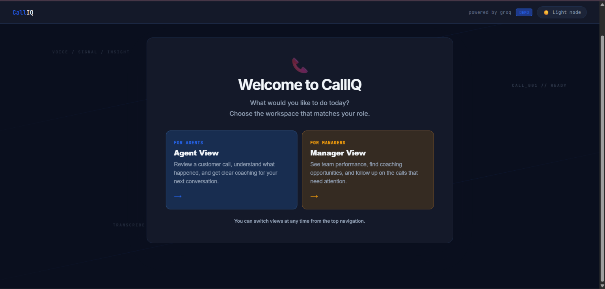
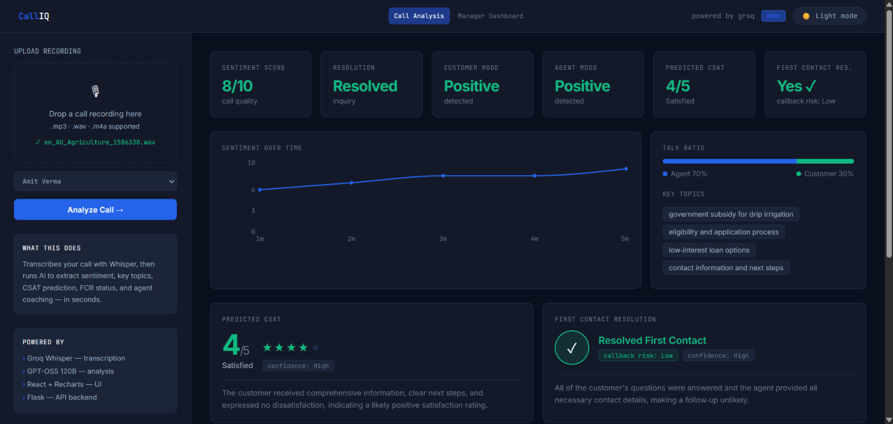
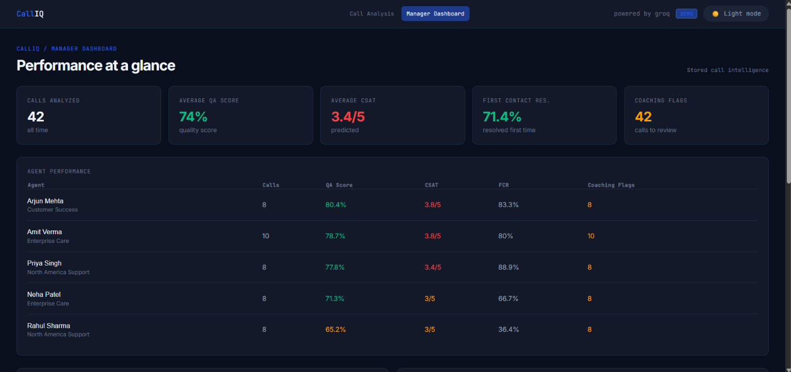
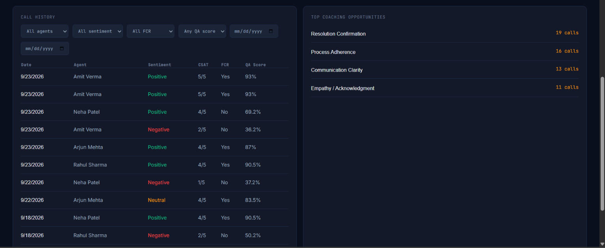
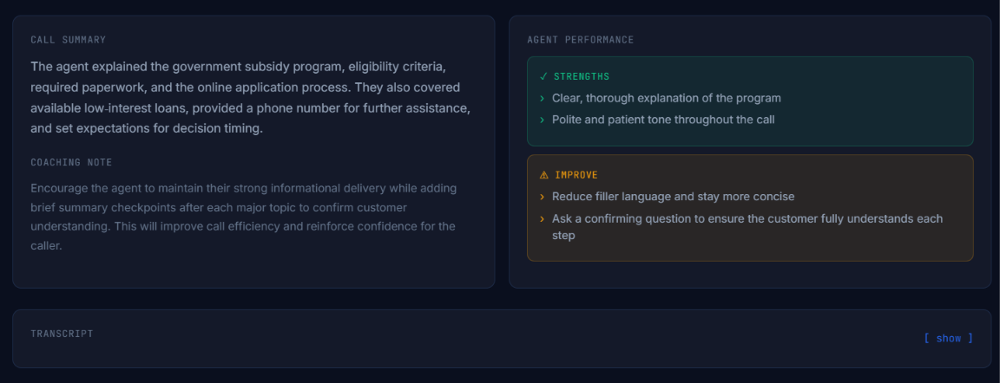

# Call Analytics

Call Analytics turns customer call recordings into transcripts and quality insights. The backend uses Groq for transcription and analysis. The frontend is a React dashboard for uploading recordings and reviewing the results.

## What it does

- Transcribes MP3, WAV, and M4A recordings
- Classifies overall, customer, and agent sentiment
- Extracts key topics and a call summary
- Predicts CSAT and first contact resolution
- Shows talk ratio and sentiment over time
- Provides agent strengths, improvement areas, and coaching notes

## Screenshots

### Welcome page



### Call analysis



### Manager dashboard



### Agent Performance





## Project structure

```text
call_analytics/
├── server.py
├── analyzer.py
├── transcriber.py
├── requirements.txt
├── sample_calls/
└── call-analytics-ui/
    ├── package.json
    ├── public/
    └── src/
```

## Requirements

- Python 3.9 or newer
- Node.js 18 or newer
- A Groq API key

## Setup

Create and activate a Python virtual environment from the project root:

```powershell
python -m venv .venv
.\.venv\Scripts\Activate.ps1
pip install -r requirements.txt
```

Install the frontend dependencies:

```powershell
cd call-analytics-ui
npm install
cd ..
```

Create a `.env` file in the project root:

```env
GROQ_API_KEY=your_groq_api_key
```

Keep `.env` private. It is ignored by Git and should not be committed.

## Run the application

Start the Flask API in one terminal:

```powershell
python server.py
```

The API runs at `http://localhost:5000`.

Start the React frontend in a second terminal:

```powershell
cd call-analytics-ui
npm start
```

Open `http://localhost:3000` in your browser.

The React development server forwards `/api` requests to the Flask API.

## Manager dashboard

The manager area is available at `http://localhost:3000/manager` after both servers are running. It reads its data from SQLite and includes agent performance, call history, filters, coaching opportunities, and links back to the existing call analysis view.

To create the local demo dataset:

```powershell
python seed_database.py
```

This creates 40 fictional calls for the five demo agents. To recreate the dataset:

```powershell
python seed_database.py --reset
```

The database is stored at `data/calliq.db` and is intentionally ignored by Git. Successful calls processed through `/api/analyze` are added to the same database.

## Build the frontend

```powershell
cd call-analytics-ui
npm run build
```

The production files are written to `call-analytics-ui/build`.

## API

### `POST /api/analyze`

Upload an audio file using the `file` form field.

Example with PowerShell:

```powershell
curl.exe -X POST http://localhost:5000/api/analyze -F "file=@sample_calls/example.wav"
```

The response includes the transcript and structured analysis data.

Manager endpoints include:

- `GET /api/manager/overview`
- `GET /api/manager/agents`
- `GET /api/manager/agents/<agent_id>`
- `GET /api/manager/calls`
- `GET /api/manager/calls/<call_id>`

## Notes

The older Streamlit interface is still in `app.py`, but the current application uses `server.py` and the React frontend.
